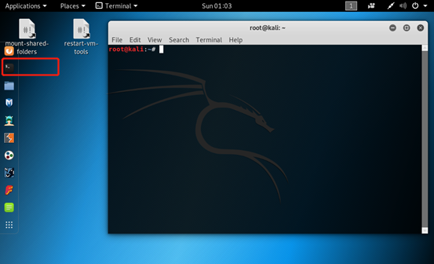
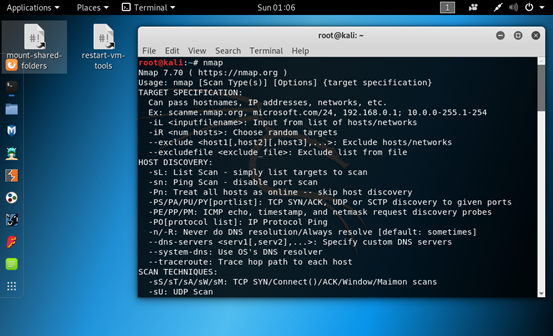
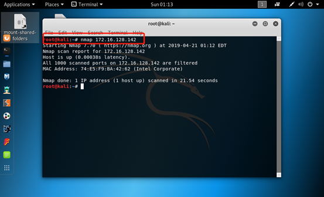
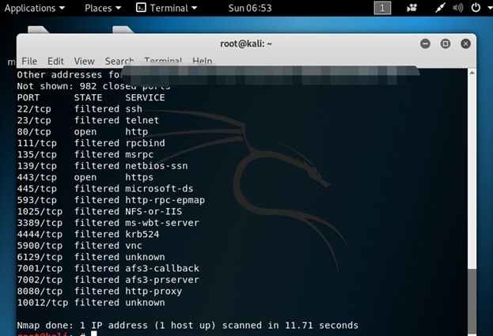
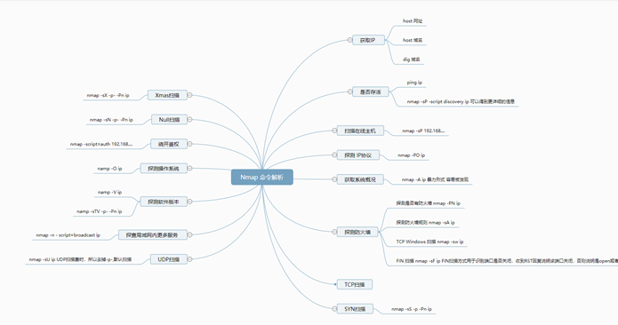

## nmap: The series of top 10 tools in Kali

**摘要：** nmap 是一个免费开源的网络探测和安全审计(安全/端口扫描器)工具，是系统运维、研发工程师以及网络安全工程师必用工具之一，用户可以在任何linux发行版本上安装这个工具。Kali 已经预安装了这个工具。

### 基础知识

**使用场景：** nmap 用来扫描主机上开放的端口，确定网络服务运行在该主机的哪一个（哪些）端口上，进而推断出计算机运行的操作系统。通过使用该工具，可以评估网络系统安全。

**主要功能：** 主要有四大功能，四项功能之间，又存在大致的依赖关系。

1. 主机发现
2. 端口扫描
3. 应用与版本侦测
4. 操作系统侦测

**操作流程：**

1. 首先用户需要进行主机发现，找出活动的主机；
2. 然后在活动主机上确定活动端口状况；
3. 根据端口扫描，确定端口上具体运行的应用程序与版本信息；
4. 对版本信息侦测后对操作系统进行侦测；

### 实操演练

**环境：** 本次演练使用kali-linux-2019.1-vm-amd64 Vmware 虚拟机镜像。

#### 预备

- 用户已经安装Kali，需要在kali 控制台上启动terminal 终端工具；

- 输入nmap 命令回车后，显示nmap的版本、平台和使用情况简要信息。

演练用nmap 使用 64位平台下7.70版本。

### 案例一

​        本演练针对nmap基础功能进行操作，熟练使用nmap指令进行主机、网络等扫描，发现活动的主机和端口等信息。

> Tips:  Linux 的 shell 指令以及安装的软件一般都有相应 man 手册( 输入 man nmap )，或者通过 nmap --help 查看帮助选项。

#### 扫描指定目标

当用户有明确的扫描目标时，可以直接使用nmap工具实施扫描。根据扫描目标的多少，可以分为扫描单个目标、多个目标及目标范围三种情况。本节将依次讲解这三种情况的扫描方式。

指定单个目标，使用nmap工具可以发起一个基本的扫描。指定的目标可以是一个IP地址，也可以是主机名（nmap会自动解析其主机名）。

语法格式如下所示：nmap [目标]
其中，参数[目标]可以是一个IP地址，也可以是一个主机名。

`nmap 172.16.128.142`

从扫描结果来看，这台机器1000以内的端口都是关闭的，nmap工具默认扫描前1000个端口，即1-1000。如果用户想扫描1000以上端口的话，需要使用-p选项来指定。
从扫描信息可知，这台机器的MAC地址信息。
从最后一行信息，可以看出目标主机是活动的（up），并且扫描该目标主机共用了21.54秒。

由于IP地址分为IPv4和IPv6两类。所以，使用nmap工具扫描单个目标时，指定的IP地址可以是IPv4，也可以是IPv6。上例中指定扫描的目标是使用IPv4类地址。如果用户指定扫描目标地址是IPv6类地址时，需要使用-6选项

#### 扫描多个目标

当用户需要扫描多个目标时，可以在命令行中同时指定多个目标，每个目标之间使用空格分割。

语法格式如下所示：nmap [目标1 目标2 ...]

`nmap 172.16.128.142 172.16.128.140 172.16.128.143`

提示：当用户同时指定扫描的目标太多时，可以使用简化符号来获取扫描结果。其中，目标地址之间使用逗号（,）分割。

例如，同时扫描以上三台主机，则可以使用如下命令：

`nmap 172.16.128.142,140,143`

#### 扫描地址范围

用户在指定扫描范围时，可以通过IP地址或子网的方式来实现。下面将介绍使用IP地址指定扫描范围的方法。

其中，语法格式如下所示：
nmap [IP地址范围]  在以上语法中，IP地址范围之间使用短连字符（-）
`nmap 172.16.128.1-100`

#### 扫描整个子网

nmap也可以使用CIDR（无类别域间路由，Classless Inter-Domain Routing）格式来扫描整个子网。CIDR将多个IP网络结合在一起，使用一种无类别的域际路由选择算法，可以减少由核心路由器运载的路由选择信息的数量。

其中，语法格式如下所示：
nmap [CIDR格式的网络地址]

`nmap 192.168.1.1/24`

扫描192.168.1.1/24整个子网中的所有主机

CIDR是由网络地址和子网掩码两部分组成，并且中间使用斜杠（/）分割。其中，CIDR和子网掩码对照表如表所示

| 子网掩码        | CIDR | 子网掩码        | CIDR |
| --------------- | ---- | --------------- | ---- |
| 000.000.000.000 | /0   | 255.255.128.000 | /17  |
| 128.000.000.000 | /1   | 255.255.192.000 | /18  |
| 192.000.000.000 | /2   | 255.255.224.000 | /19  |
| 224.000.000.000 | /3   | 255.255.240.000 | /20  |
| 240.000.000.000 | /4   | 255.255.248.000 | /21  |
| 248.000.000.000 | /5   | 255.255.252.000 | /22  |
| 252.000.000.000 | /6   | 255.255.254.000 | /23  |
| 254.000.000.000 | /7   | 255.255.255.000 | /24  |
| 255.000.000.000 | /8   | 255.255.255.128 | /25  |
| 255.128.000.000 | /9   | 255.255.255.192 | /26  |
| 255.192.000.000 | /10  | 255.255.255.224 | /27  |
| 255.224.000.000 | /11  | 255.255.255.240 | /28  |
| 255.240.000.000 | /12  | 255.255.255.248 | /29  |
| 255.248.000.000 | /13  | 255.255.255.252 | /30  |
| 255.252.000.000 | /14  | 255.255.255.254 | /31  |
| 255.254.000.000 | /15  | 255.255.255.255 | /32  |
| 255.255.000.000 | /16  |                 |      |

#### 实施全面扫描

实施扫描时，使用不同的选项，则扫描内容不同。用户可以使用不同的选项，单独扫描目标主机上的端口、应用程序版本或操作系统类型等。但是，大部分人又不太喜欢记这些选项。这时候，用户只需要记一个选项-A即可。该选项可以对目标主机实施全面扫描，扫描结果中包括各种类型的信息。

其中，实施全面扫描的语法格式如下所示：
nmap -A [目标]

`nmap -A 172.16.128.142`

### 扫描结果解读

#### State 状态类别

**Open** 端口处于开放状态，例如：当nmap使用TCP SYN对目标主机某一范围的端口进行扫描时，我们知道 TCP SYN报文是TCP建立连接的第一步，所以，如果目标主机返回SYN+ACK的报文，我们就认为此端口开放了并且使用了TCP服务。

**Closed** 端口处于关闭状态。例如：TCP SYN类型的扫描，如果返回RST类型的报文，则端口处于管理状态。这里我们值得注意的是关闭的端口也是可访问的，只是没有上层的服务在监听这个端口，而且，只是在我们扫描的这个时刻为关闭，当我们在另一个时间段进行扫描的时候，这些关闭的端口可能会处于open的状态。

**Filtered** 由于报文无法到达指定的端口，nmap不能够决定端口的开放状态，这主要是由于网络或者主机安装了一些防火墙所导致的。当nmap收到icmp报文主机不可达报文（例如：type为3，code为13（communication administratively prohibit）报文）或者目标主机无应答，常常会将目标主机的状态设置为filtered。

**Unfiltered** nmap不能确定端口是否开放的时候所打上的状态。

该状态和filtered的区别在于：unfiltered的端口能被nmap访问，但是nmap根据返回的报文无法确定端口的开放状态，而filtered的端口表示nmap无法访问。

端口被定义为Unfilterd只会发生在TCP ack扫描类型时当返回RST的报文。

端口被定义为filtered 状态的原因是报文被防火墙设备，路由器规则，或者防火墙软件拦截，无法送达到端口，这通常表现为发送nmap的主机收到ICMP报错报文，如：TYPE为3，code为13的报文（通信被认为的禁止 communication administratively prohibited），或者主机通过多次重复发送没有收到任何回应）。

**Open|filtered** 主要是nmap无法区别端口处于open状态还是filtered状态。这种状态只会出现在open端口对报文不做回应的扫描类型中，如：udp，ip protocol ，TCP null，fin，和xmas扫描类型。

#### 案例说明

我们试图扫描某大学官方网站（请勿反复大量执行 nmap 扫描，避免对主机方造成损害）

`nmap -A  XXX.XXX.XXX.XXX`

从以上输出的信息，明显看出比前面例子扫描结果更详细，我们观察到目标主机上开启的端口、应用服务、版本、操作系统版本、内核、系统类型等。

可知目标主机上运行了TCP、SSH、Telnet等服务，并且可以看到各服务的版本及权限信息。

### 知识点总结

#### 技能树

### 自我训练

#### 目的

1. 了解网络扫描技术在网络安全攻防中价值；
2. 熟练使用 nmap 工具进行网络扫描，掌握各参数的含义以及所对应的扫描类型；
3. 理解 nmap 输出结果并进行分析；

#### 任务

任务1：找到合适的测试环境：例如本宿舍的无线局域网内，征得室友的同意；
不要以学校办公网络或者实验室网络做目标网络。

任务2：使用nmap对实验网络所在网段的所有主机进行Ping扫描 ping scan 排除自己主机，检测有多少主机在线。
nmap -sn 192.168......

任务3：使用nmap对局域网内某台存活的主机进行Xmas scans 隐蔽扫描和UDP扫描 分析扫描结果

任务4：namp -v www.csdn.net 和nmap -vv www.csdn.net 根据结果总结有什么区别。

任务5：扫描除某一个目标地址之外的所有目标地址（自查资料）

任务6：目标地址的操作系统指纹识别（自查资料）

任务7：对目标主机或目标主机所在的网段进行应用弱口令检测（自查资料）

任务8：nmap思维导图中选择三项知识点做深入学习，总结这三项知识点的作用。
例如圣诞树xmas tree的作用。
建议将三项知识点学习心得和练习结果、分析总结分享到群里。
